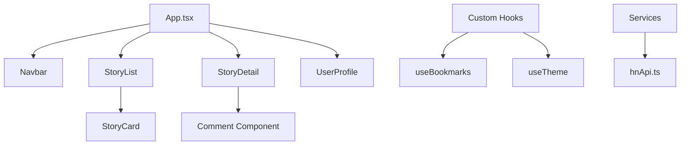

# Hacker News 2026 🚀

A modern, high-performance, and highly customizable Hacker News client built for the next generation of tech enthusiasts.


### Screenshots


## Why I Built This

Hacker News is the heartbeat of the tech world, but its interface hasn't changed much in decades. I wanted to create a reading experience that respects the original's simplicity while embracing modern web standards. **Hacker News 2026** is my vision of a "pro" reading environment—fast, accessible, and deeply customizable.

I focused on three core pillars:
1. **Readability**: Multiple themes (Sepia, High Contrast) and font choices (Serif, Outfit) to reduce eye strain.
2. **Efficiency**: Keyboard-first navigation (`J`/`K` to move, `Enter` to open) for power users.
3. **Real-time**: Intelligent polling that keeps you updated on trending discussions without refreshing.

## Tech Stack

- **Frontend**: React 18 + TypeScript
- **Build Tool**: Vite (for near-instant HMR and optimized builds)
- **Styling**: Tailwind CSS (Utility-first, theme-aware)
- **Animations**: Motion (formerly Framer Motion)
- **Icons**: Lucide React
- **Data Fetching**: Hacker News Firebase API (via custom service layer)

## Architecture

The project follows a clean, modular architecture:



### Key Components

- **`StoryList`**: Handles infinite scrolling, keyboard navigation logic, and real-time polling.
- **`StoryDetail`**: Manages complex comment trees and real-time updates for active discussions.
- **`ThemeContext`**: A robust system that injects CSS variables globally for instant mode switching.

## Features

- 🌓 **4 Distinct Themes**: Light, Dark, Sepia, and High Contrast.
- 🔡 **Font Customization**: Choose between Sans, Serif, and the modern Outfit font.
- ⌨️ **Keyboard Shortcuts**:
  - `J` / `K`: Navigate stories
  - `Enter`: Open story
  - `B`: Toggle bookmark
- 📊 **User Insights**: Detailed stats for every HN user, including karma and submission breakdowns.
- 🔖 **Local Bookmarks**: Save stories for later, persisted in your browser.
- 🔄 **Smart Polling**: Automatically fetches new comments and updates scores.

## Getting Started

### Prerequisites

- Node.js 18+
- npm or yarn

### Installation

1. Fork the repository
2. Clone your fork:
   ```bash
   git clone https://github.com/harishkotra/hacker-news-2026.git
   ```
3. Install dependencies:
   ```bash
   npm install
   ```
4. Start the development server:
   ```bash
   npm run dev
   ```

## Contributing

I'd love to see this project grow! Here are some ideas for features you could add:

- [ ] **Search Integration**: Add Algolia-powered search for historical stories.
- [ ] **Offline Support**: Implement a Service Worker for PWA capabilities.
- [ ] **User Mentions**: Highlight mentions in comment threads.
- [ ] **Custom Filters**: Filter stories by domain or minimum score.

### How to Contribute

1. Create a new branch: `git checkout -b feature/your-feature-name`
2. Commit your changes: `git commit -m 'Add some feature'`
3. Push to the branch: `git push origin feature/your-feature-name`
4. Open a Pull Request

Inspired by [https://x.com/MakerThrive/status/2035533184176144475](https://x.com/MakerThrive/status/2035533184176144475)
